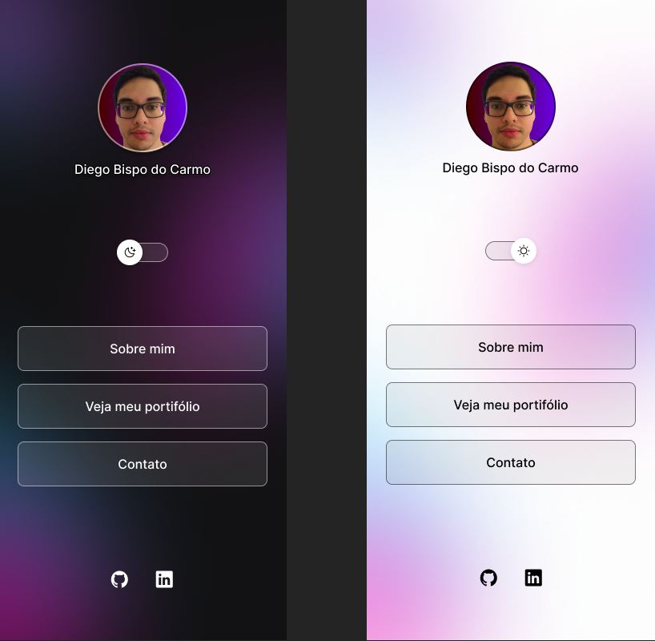

<h1 align="center">💫Meu Primeiro Projeto </h1>

Meu primeiro projeto de aprendizado básico, e contato com o front-end, com os passos da Rocketseat.  

##

  

## 💫	 Tecnologias

Esse projeto foi desenvolvido com as seguintes tecnologias:

- HTML 
- CSS 
- JavaScript
- Figma

